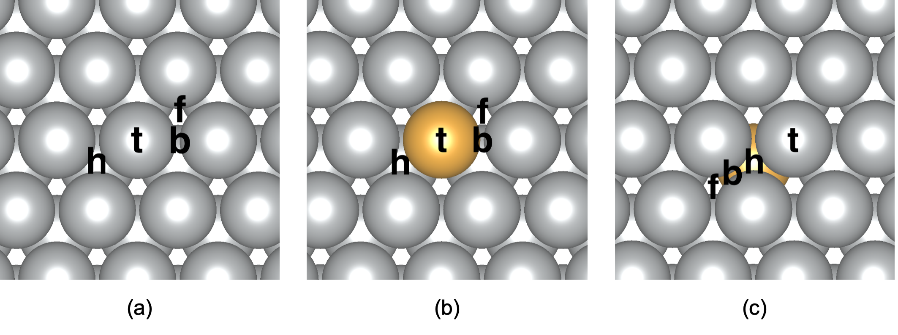
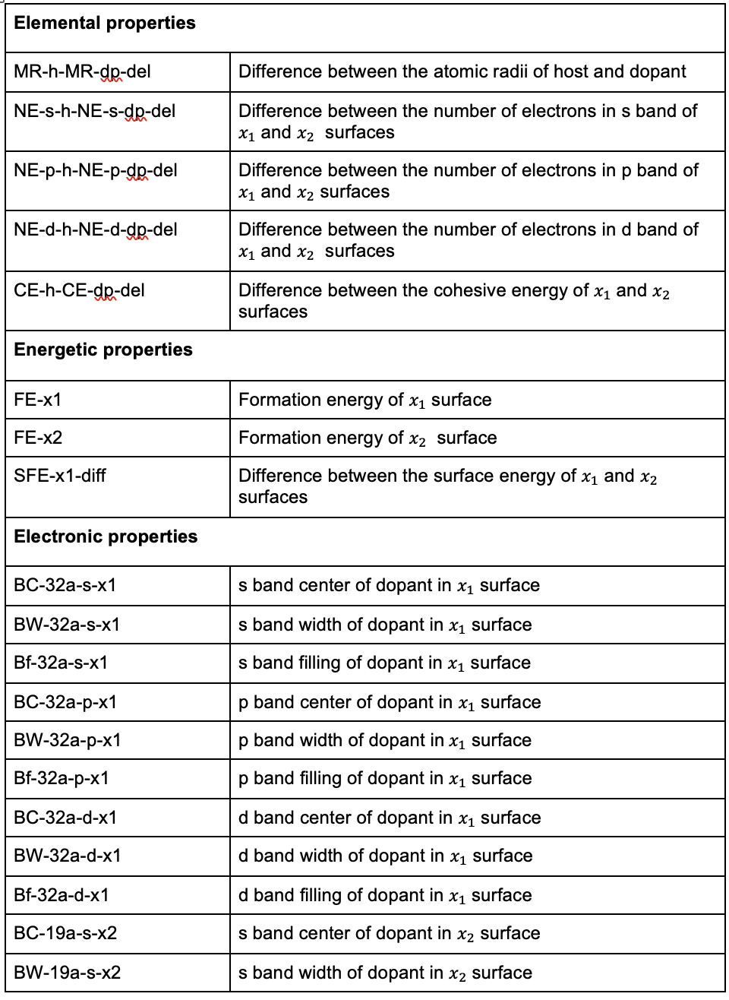
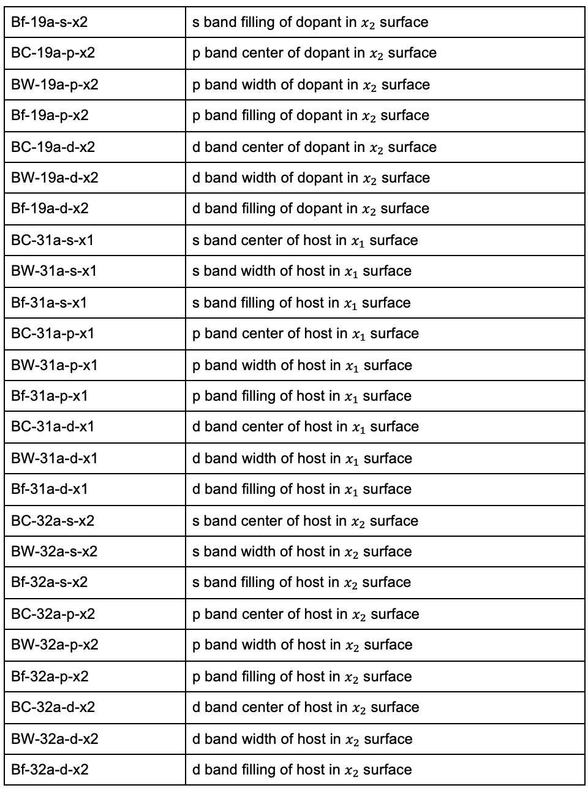
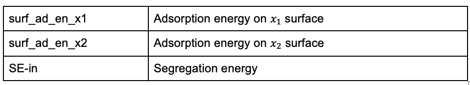
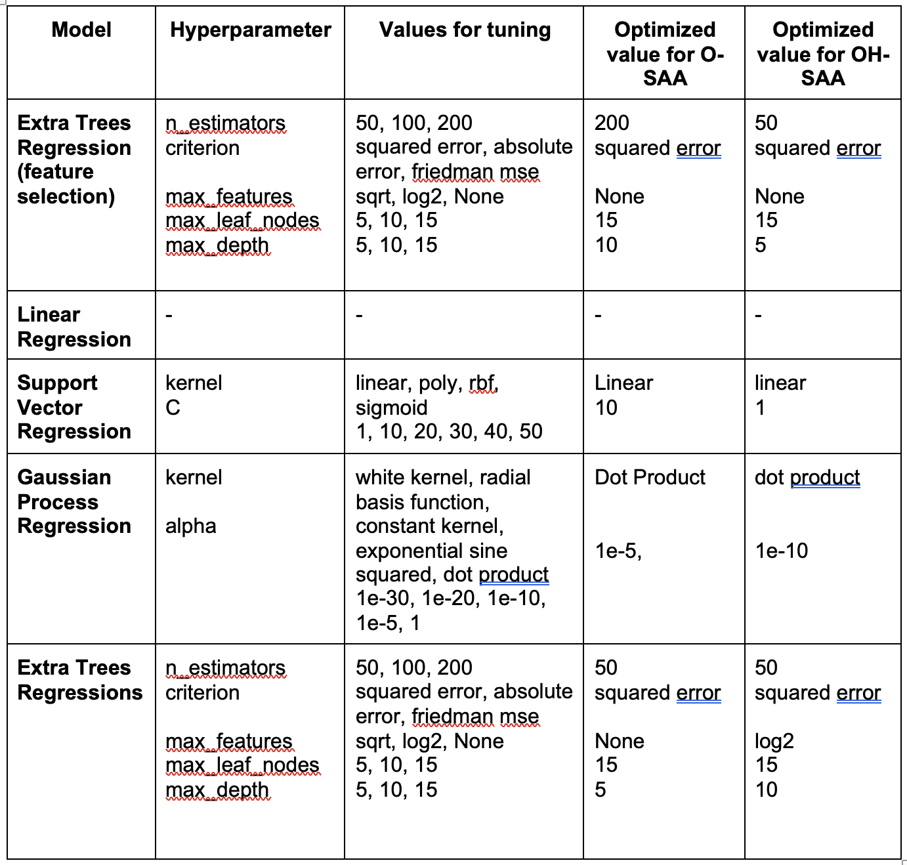

# O- and OH-induced dopant segregation in single atom alloy surfaces: A combined density functional theory and machine learning study
Anne Nicole P. Hipolito, Marianne A. Palmero, Viejay Z. Ordillo, Koji Shimizu, Darwin B. Putungan, Alexandra B. Santos-Putungan, Joey D. Ocon, Satoshi Watanabe2, Karl Ezra S. Pilario, Allan Abraham B. Padama

https://doi.org/10.1016/j.commatsci.2023.112607

<p align="right">(<a href="#readme-top">back to top</a>)</p>

## Abstract
In this study, we identified the significant factors affecting adsorbate-induced segregation in single-atom alloy (SAA) surfaces by performing Density Functional Theory (DFT)-based calculations and machine learning (ML) methods. We used O and OH species, which are key reactants in oxygen reduction reactions (ORR), as test adsorbates. We constructed SAA surfaces using different transition metals (Ag, Au, Co, Cu, Ir, Ni, Pd, Pt, and Rh) and calculated their segregation energies with and without the adsorbates to predict the segregation tendency of the dopant atom. We examined a total of 44 features which comprised of the elemental, energetics, and electronic properties of the SAAs. We employed a two-stage feature selection to reduce the number of features to the most important features for model training. We found that the formation energies, metallic radius difference, the d-band centers of the dopant in the surface and subsurface layer, the difference in surface energy between the host and dopant atoms, and the difference in the total number of d-electrons between the host and dopant atoms influence the segregation energy of the dopant induced by O and OH. Using these selected features, we implemented linear regression (LR), support vector machine regression (SVR), Gaussian process regression (GPR), and extra trees regression (ETR) algorithms to predict the segregation energies in the presence of adsorbates. For both O- and OH-SAA systems, SVR models exhibited the best performance for predicting adsorbate-induced segregation energies. Among the surfaces we considered, we determined Rh-Au(1 1 1) as a potential catalyst for ORR based on the calculated adsorption energies of O and OH and segregation energies in the presence of these adsorbates.

## Installation

You can download the data used in this study by cloning the git repository:
   ```sh
   git clone {LINK TO REPO}
   ```

[//]: # (To install the required packages, use)

[//]: # (   ```sh)

[//]: # (   pip install -r requirement.txt)

[//]: # (   ```)

<p align="right">(<a href="#readme-top">back to top</a>)</p>

<!-- USAGE EXAMPLES -->
## Computational Details

> ### DFT 
> **Software**: Quantum Espresso ver. 6.5
> 
> **Pseudopotential**: Ultrasoft
>
> **Kpoints**: 4 x 4 x 1 Monkhorst-Pack k-points mesh 
> 
> **Energy Cutoff**: 600 eV 
>
> **Force Convergence Threshold**: 0.03 eV/Å 
> 
> **Energy Convergence Threshold**: 1x10-5 eV
>
> **Transition Metals Considered**: Co, Ni, Cu, Rh, Pd, Ag, Ir, Pt, Au
> 
> **Slab Model**:  3 x 3 x 4 supercell of the (111) facet, with 15 Å vacuum layer (shown in the figure below): 
> 
>   * (a) pure surface 
>   
>   * (b) SAA - dopant is in the first layer
> 
>   * (c) SAA - dopant is in the second layer
> 
> **Adsorbates considered in this study**: O and OH
>
> **Adsorption sites considered in this study**: hcp(h), top(t), bridge(h), fcc(f)
>
> 

> ### Machine Learning
> **Data**: 78 Rows
> #### Naming Conventions for  Features:
> 
> 
> #### Naming Conventions for  Adsorption Energy and Segregation Energy:
> 
> #### Machine Learning Models:
> 


<p align="right">(<a href="#readme-top">back to top</a>)</p>


<!-- LICENSE -->
## Citation
Hipolito, A. N. P., Palmero, M. A., Ordillo, V. Z., Shimizu, K., Putungan, D. B., Santos-Putungan, A. B., ... & Padama, A. A. B. (2024). O-and OH-induced dopant segregation in single atom alloy surfaces: A combined density functional theory and machine learning study. Computational Materials Science, 232, 112607.
<p align="right">(<a href="#readme-top">back to top</a>)</p>


<!-- CONTACT -->
## Contact

Email: abpadama@up.edu.ph

<p align="right">(<a href="#readme-top">back to top</a>)</p>


<!-- ACKNOWLEDGMENTS -->
## Acknowledgments

This work was primarily funded by the Department of Science and Technology - Philippine Council for Industry, Energy, and Emerging Technology Research and Development (DOST-PCIEERD) with Project No. 10128, 2022. This project is under the East Asia Science and Innovation Area Joint Research Program (e-ASIA JRP) titled "Computational Design of High Entropy Alloys for Catalyst and Battery Applications". All calculations were performed using the computing facilities of the Watanabe Laboratory of The University of Tokyo, the Computing and Archiving Research Environment of DOST - Advanced Science and Technology Institute, the Institute of Mathematical Sciences and Physics of the University of the Philippines Los Baños, and the supercomputer Fugaku (Japan).
<p align="right">(<a href="#readme-top">back to top</a>)</p>


